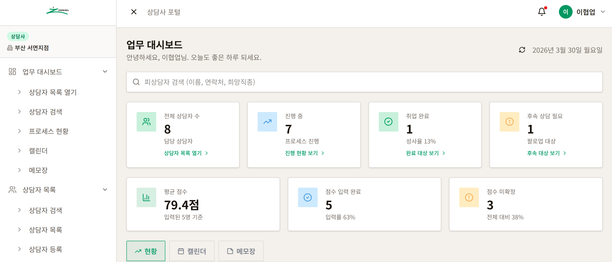
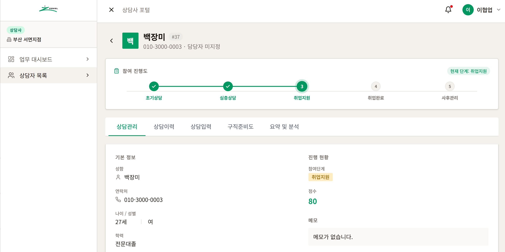
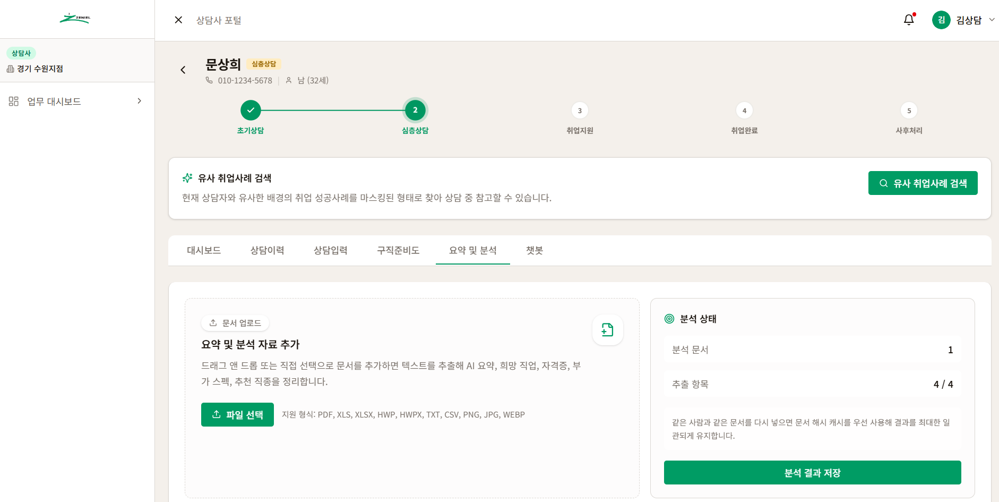
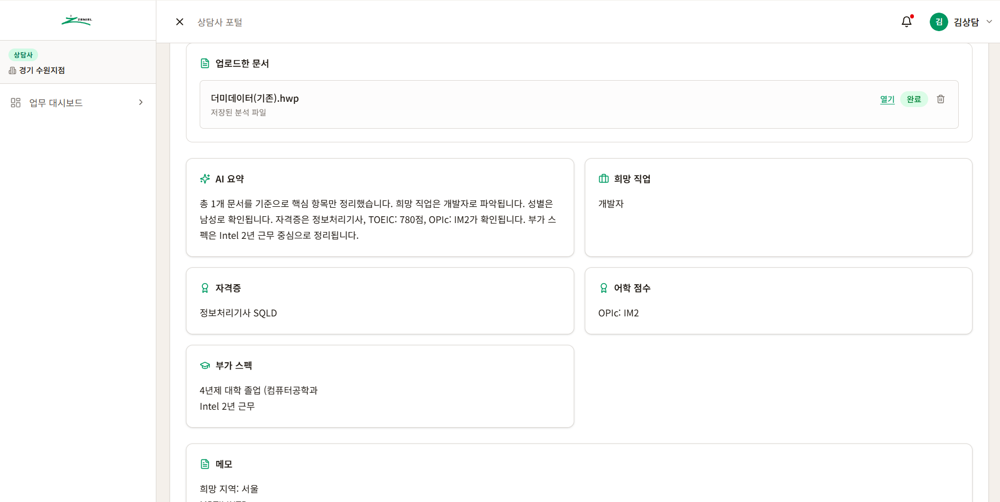
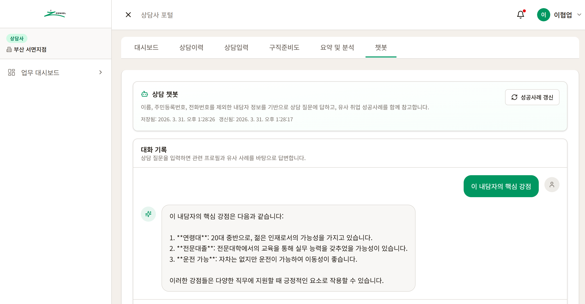
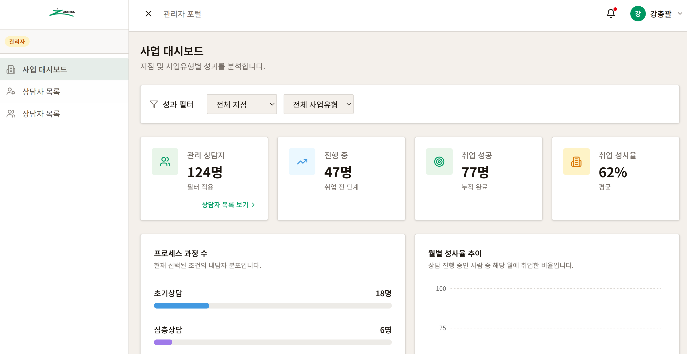
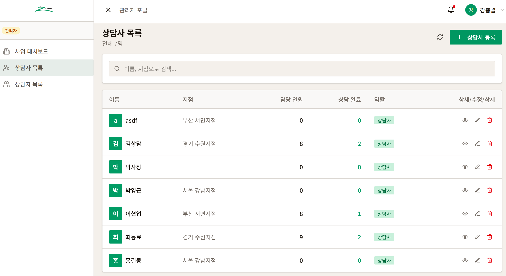
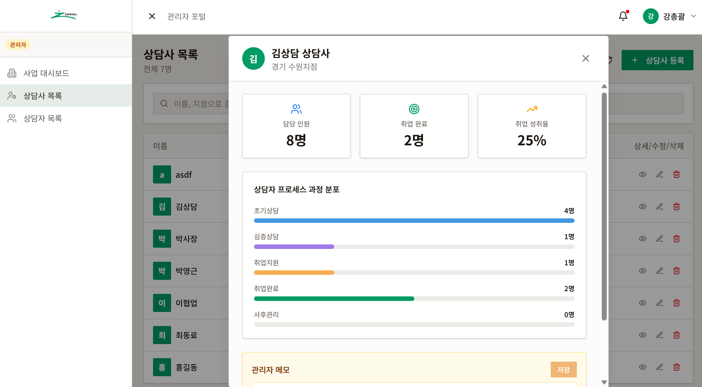
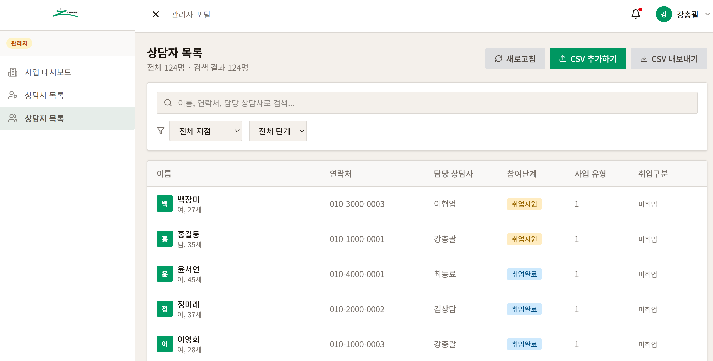

# ZeniManager — AI 기반 상담 고도화 및 표준화 시스템

> **제니엘(Zeniel)** 취업 지원 사업의 상담 업무를 데이터 중심으로 표준화하기 위한 React 기반 데스크탑 앱(Electron 변환 가능) 및 웹 애플리케이션입니다.  
> 상담 기록, 문서 분석, 유사 성공 사례, 관리자 통계까지 한 화면에서 관리하도록 설계했습니다.

<p align="center">
  
  
  
  
  
  
</p>

---

## 목차

- [프로젝트 개요](#프로젝트-개요)
- [주요 기능](#주요-기능)
- [AI 처리 흐름](#ai-처리-흐름)
- [팀원별 역할](#팀원별-역할)
- [PPT 기반 기능 소개](#ppt-기반-기능-소개)
- [기술 스택](#기술-스택)
- [화면 구성](#화면-구성)
- [시작하기](#시작하기)
- [Supabase 설정](#supabase-설정)
- [Electron 데스크탑 빌드](#electron-데스크탑-빌드)
- [릴리스 방법](#릴리스-방법)
- [프로젝트 구조](#프로젝트-구조)
- [보안 정책](#보안-정책)
- [라이선스](#라이선스)

---

## 현행 프로세스 분석 및 문제 정의

PPT의 문제 정의 파트에서는 상담 업무의 핵심 병목을 아래처럼 정리합니다.

- **프로세스 가시성 저하**: 엑셀 수동 관리 중심이라 실시간 사업 현황 파악이 늦어집니다.
- **상담 품질의 편차**: 상담사별 기록 방식이 달라 상담 결과의 표준화가 어렵습니다.
- **데이터 활용 한계**: 비정형 상담 기록이 많아 유사 사례 분석과 역량 진단을 객관적으로 하기 어렵습니다.
- **서비스 상용화 한계**: 웹 서버 종속 구조에서는 클라이언트 단독 활용과 배포 유연성이 떨어집니다.

핵심 인사이트는 다음과 같습니다.

- 데이터 중심의 분석 환경 구축이 필요합니다.
- 상담 기록을 구조화해 상담 품질을 표준화해야 합니다.
- 독립적으로 실행 가능한 애플리케이션 형태가 필요합니다.

---

## 프로젝트 개요

ZeniManager는 상담사가 남기는 비정형 상담 기록과 업로드 문서를 구조화해, 상담 품질을 표준화하고 사업 성과를 실시간으로 확인하는 것을 목표로 합니다.

- 상담사와 관리자를 분리한 역할 기반 포털
- HWP, PDF, Word, CSV 등 다양한 문서 입력 지원
- AI 요약, 유사 성공 사례 탐색, 역량 분석, 추천 직무 생성
- Supabase 기반 실시간 저장/조회와 RLS 보안 정책 적용
- Electron 데스크탑 앱 또는 웹 앱으로 동일한 흐름 제공

---

## 주요 기능

### 상담사 포털
- **업무 대시보드**: 전체 상담자 수, 진행 현황, 완료/후속 상담, 평균 점수, 캘린더, 메모장
- **상담자 목록**: 검색, 필터, 상세 모달, 상담 관리, 상담 이력, 상담 입력, 단계별 진행 관리
- **AI 상담 지원**: 문서 요약, 핵심 강점 추출, 유사 취업 사례 검색, 추천 직무/산업 분석
- **상담자 등록**: 신규 상담자 정보 입력 폼
- **구직준비도 설문 관리**: 8문항 설문 입력·조회·수정, 총점 자동 계산
- **상담 챗봇**: 상담 질문 기반으로 관련 프로필과 유사 사례를 함께 참고하는 대화형 지원

### 관리자 포털
- **사업 대시보드**: 지점별 / 사업별(유형) / 취업구분(성사율) 통계 시각화
- **상담사 목록**: 상담사 CRUD, CSV 추가/내보내기, 상세 성과 모니터링
- **상담자 목록**: 전체 상담자 조회, 필터링, 상태 추적, 운영 관제

### 공통
- **역할 기반 접근 제어**: 상담사 / 관리자 역할 분리, Supabase RLS 적용
- **보안 키 관리**: API 키를 코드에 포함하지 않고 앱 Settings에서 런타임 입력
- **Supabase 연동**: 실시간 데이터 저장·조회, 미설정 시 목업 데이터로 자동 전환
- **문서 파이프라인**: 업로드된 문서를 정규화하고 JSON/API 형태로 후속 분석에 사용

---

## AI 처리 흐름

PPT에 정리된 시스템 파이프라인을 README용으로 요약하면 다음과 같습니다.

1. **데이터 업로드**
   - 내담자 정보 파일 업로드
   - Word, PDF, CSV 지원
   - HWP 파일 자동 감지
2. **자동 정규화**
   - HWP → PDF 라이브러리 변환
   - GPT 기반 텍스트 정규화
   - 비정형 데이터를 상담 분석용 구조로 변환
3. **저장 및 분석**
   - Supabase DB / Vector 저장
   - AI 요약 및 추천 정보 생성
   - RLS 기반 보안 인가 적용
4. **실시간 조회**
   - Supabase API 연동
   - 분석 내역 즉시 확인
   - 통계 대시보드와 관리 화면에 반영

---

## 팀원별 역할

PPT의 역할 분담을 README 기준으로 정리했습니다.

| 이름 | 역할 | 담당 범위 |
|------|------|-----------|
| 고준수 | Project Leader / Planning | 로그인, API 주소 및 키 등록 설정 총괄, 기술 스택 및 개발 방향성 선정, 상담자 입력 프론트 |
| 구건모 | Frontend Dev | UI/UX 프론트 뷰, 상담자 목록, 업무 대시보드, 캘린더, 상담 메모 기능 |
| 문상희 | Backend Dev | Supabase API 및 쿼리 세팅, 상담 디테일 페이지(관리 / 이력 / 프로세스 기록) |
| 류시은 | Admin Dev | 관리자 페이지 구축, 통계 및 DB 관리 대시보드, 전사적 모니터링, Excel 입력/출력 |
| 양재식 | AI Function Dev | AI 상담 / 요약 페이지(JSON API), 자격증 정보 API 결합, 점수화 모델 및 GPT 프롬프트 설계, HWP / Excel 데이터 정형화 |

---

## PPT 기반 기능 소개

### 상담사 대시보드



- 전체 상담자 수, 진행 중, 취업 완료, 후속 상담 필요 상태를 한눈에 확인합니다.
- 캘린더와 메모장 탭을 통해 일정을 관리하고 업무 메모를 남길 수 있습니다.

### 상담자 상세 화면



- 상담 진행 단계를 시각적으로 보여주고, 현재 단계와 상담관리 정보를 함께 확인합니다.
- 상담관리, 상담이력, 상담입력, 구직준비도, 요약 및 분석 탭으로 세부 업무를 나눕니다.

### AI 요약 및 분석



- HWP, PDF, XLSX, TXT, CSV, 이미지 파일을 업로드해 분석 자료로 활용합니다.
- 문서 업로드 후 분석 상태를 확인하고, 요약 및 분석 결과를 저장할 수 있습니다.

### 상담 프로필 요약



- 업로드 문서 기반으로 AI 요약, 희망 직업, 자격증, 어학 점수, 부가 스펙을 구조화합니다.
- 상담사가 이후 상담과 추천 직무 검토에 바로 사용할 수 있는 카드형 정보로 정리됩니다.

### 상담 챗봇



- 상담자의 핵심 강점을 자동 정리하고, 유사 취업 사례를 참고해 답변을 제공합니다.
- 대화 기록을 남기면서 상담에 바로 활용 가능한 문맥형 지원을 제공합니다.

### 관리자 사업 대시보드



- 지점별, 사업유형별, 취업성사율 기반의 운영 통계를 확인합니다.
- 상담 진행 단계와 취업 결과를 카드와 차트로 시각화합니다.

### 상담사 및 상담자 관리



- 상담사 CRUD, 검색, 필터, CSV 내보내기를 지원합니다.
- 상담사별 담당 인원, 완료 수, 성과를 한 화면에서 관리할 수 있습니다.



- 특정 상담사의 담당 인원, 취업 완료, 취업 성취율, 단계별 분포를 세부적으로 확인합니다.
- 관리자 메모를 입력해 운영 기록을 남길 수 있습니다.



- 전체 상담자와 담당 상담사, 참여 단계, 사업 유형, 취업구분을 함께 관리합니다.
- 관리자 입장에서 전체 상담자 현황을 빠르게 파악하는 운영 화면입니다.

---

## 기술 스택

| 영역 | 기술 |
|------|------|
| 프론트엔드 | React 19, TypeScript, Vite 7, TailwindCSS 4 |
| UI 컴포넌트 | shadcn/ui (Radix UI), Recharts, Lucide Icons |
| 데이터베이스 | Supabase (PostgreSQL) |
| 인증 | Supabase Auth |
| 데스크탑 | Electron 41, electron-builder |
| 폰트 | Noto Sans KR (Google Fonts) |
| 테스트 | Vitest |

---

## 화면 구성

```
로그인
├── 역할 선택 (상담사 / 관리자)
├── 이메일 / 비밀번호 입력
└── Supabase 연결 설정 (접기/펼치기)

상담사 (고정 사이드바)
├── 업무 대시보드
│   ├── 통계 카드 (전체 상담자 수, 프로세스 현황)
│   ├── 월별 상담 차트
│   ├── 캘린더
│   └── 칸반 메모장
├── 상담자 목록
│   ├── 검색 (전체 / 점수미확정 / 후속상담 / 취업처리)
│   ├── 상담자 테이블
│   └── 상세 모달 (상담관리 · 상담이력 · 상담내용 입력 · 구직준비도 설문 · 요약 및 분석 · 챗봇)
└── 상담자 등록

관리자 (고정 사이드바)
├── 사업 대시보드
│   ├── 지점별 통계
│   ├── 사업별(유형) 통계
│   └── 취업구분(성사율) 통계
├── 상담사 목록
└── 상담자 목록
```

---

## 시작하기

### 사전 요구사항

- Node.js 18 이상
- Corepack 사용 가능 환경 권장 (`corepack enable`)
- pnpm 10 이상 (전역 설치를 이미 사용 중인 경우)

### 설치 및 실행

```bash
# 1. 저장소 클론
git clone https://github.com/SuranS2/ZeniManager.git
cd ZeniManager

# 2-A. Corepack 사용 시 (최초 1회)
corepack enable

# 2-B. 전역 pnpm 설치 시 (둘 중 하나만 선택)
npm install -g pnpm

# 3. 의존성 설치
corepack pnpm install

# 4. 개발 서버 실행 (웹 브라우저)
corepack pnpm dev

# 5. Electron 개발 모드 실행 (데스크탑 창)
corepack pnpm electron:dev
```

전역 `pnpm`을 설치했다면 아래처럼 `corepack` 없이 실행해도 됩니다.

```bash
pnpm install
pnpm dev
pnpm electron:dev
```

PowerShell에서 `npm` 또는 `pnpm` 스크립트 실행이 막히면 새 터미널을 다시 열거나 `npm.cmd`, `pnpm.cmd`로 실행하세요.

`pnpm install` 시 Electron 바이너리가 누락된 상태면 `postinstall`에서 자동 복구합니다. 이미 설치를 마친 뒤 `Electron failed to install correctly` 오류가 발생하면 `pnpm electron:ensure`를 한 번 실행한 뒤 다시 `pnpm electron:dev`를 실행하세요.

`pnpm dev`는 Vite 개발 서버를 구동하며 기본 접속 주소는 `http://localhost:5173`입니다.

Windows에서도 `pnpm dev`가 동작하도록 `package.json`의 개발/실행 스크립트는 `cross-env`를 사용합니다.

### 데모 계정 안내

Supabase가 미설정된 환경에서는 로컬 로그인 흐름 대신 Supabase 연결을 먼저 구성한 뒤 사용하는 방식을 권장합니다.

---

## Supabase 설정

### 1단계: 스키마 적용

1. [Supabase 대시보드](https://supabase.com/dashboard) → 프로젝트 선택
2. 좌측 메뉴 **SQL Editor** 클릭
3. 프로젝트 루트의 `supabase_setup.sql` 파일 내용을 붙여넣고 **Run** 실행

### 2단계: 테스트 계정 생성

Supabase 대시보드 → **Authentication** → **Users** → **Add user** 에서 테스트 계정을 생성합니다.

생성 후 `supabase_setup.sql` 하단 주석의 INSERT 문에 UUID를 입력하여 실행합니다.

### 3단계: 앱에서 연결

앱 로그인 화면 하단 **Supabase 연결 설정** 또는 로그인 후 **설정** 메뉴에서:

- **Project URL**: `https://your-project-id.supabase.co`
- **Anon Key**: Supabase 대시보드 → Settings → API → `anon public` 키

> 입력된 키는 기기의 `localStorage`에만 저장되며 외부로 전송되지 않습니다.

---

## Electron 데스크탑 빌드

자세한 내용은 [ELECTRON_BUILD.md](./ELECTRON_BUILD.md)를 참고하세요.

```bash
# Windows portable exe
pnpm electron:build:win

# macOS DMG
pnpm electron:build:mac

# Linux AppImage
pnpm electron:build:linux
```

`pnpm electron:build:win`은 Windows portable exe를 생성합니다.

빌드 결과물은 `release/{version}/` 디렉토리에 생성됩니다.

> **아이콘 준비 필요**: 빌드 전 `electron/icons/README.md`를 참고하여 아이콘 파일을 추가해야 합니다.

---

## 릴리스 방법

현재 Windows 배포는 `portable` 전용 정책을 사용합니다.

1. `main` 브랜치로 PR을 머지합니다.
2. GitHub Actions가 최신 태그를 기준으로 다음 patch 버전을 자동 계산합니다.
3. Windows portable 빌드를 실행합니다.
   ```bash
   pnpm electron:build:win
   ```
4. `release/{version}/` 아래에 생성된 portable exe를 확인합니다.
5. 워크플로우가 자동으로 `v{version}` 태그를 만들고 GitHub Release를 생성합니다.

설치형 `Setup.exe`는 현재 릴리스 정책에서 제외되어 있습니다.

---

## 프로젝트 구조

```
ZeniManager/
├── client/                    # 프론트엔드 (React + Vite)
│   └── src/
│       ├── components/        # 공통 UI 컴포넌트
│       ├── contexts/          # React Context (Auth 등)
│       ├── hooks/             # 커스텀 훅 (useElectron 등)
│       ├── lib/               # Supabase 클라이언트, API 레이어, 목업 데이터
│       └── pages/
│           ├── counselor/     # 상담사 페이지 (Dashboard, ClientList, ClientRegister)
│           ├── admin/         # 관리자 페이지 (AdminDashboard, CounselorList, AdminClientList)
│           ├── Login.tsx
│           └── Settings.tsx
├── electron/                  # Electron 메인 프로세스
│   ├── main.cjs               # BrowserWindow, IPC, 네이티브 메뉴
│   ├── preload.cjs            # contextBridge IPC 브릿지
│   ├── entitlements.mac.plist # macOS 권한 설정
│   └── icons/                 # 앱 아이콘 (빌드 전 추가 필요)
├── supabase_setup.sql         # Supabase 스키마 + RLS 정책
├── electron-builder.yml       # Electron 빌드 설정
├── vite.electron.config.ts    # Electron 전용 Vite 설정
└── ELECTRON_BUILD.md          # Electron 빌드 가이드
```

---

## 보안 정책

이 프로젝트는 GitHub 공개 저장소에 안전하게 올릴 수 있도록 설계되었습니다.

- **API 키 미포함**: Supabase URL, Anon Key, Service Role Key 등 모든 자격증명은 코드에 포함되지 않으며 앱 Settings에서 런타임에 입력합니다.
- **앱 설정 저장 위치**: Electron에서는 Settings 값이 `app.getPath("userData")/app-settings.json`에 저장되고, 실행 시 로컬 `localStorage`로 다시 복원됩니다.
- **설정 파일 삭제 방법**: `app-settings.json`을 삭제하면 Supabase URL, Anon Key, Service Role Key, OpenAI API Key 같은 비핵심 저장값을 초기화할 수 있습니다. 단, 앱이 다시 실행되면 남아 있는 브라우저 `localStorage` 값이 있으면 일부 설정은 다시 보일 수 있습니다.
- **완전 초기화**: 설정 화면에서 각 키를 삭제하거나, 브라우저 개발자 도구에서 `localStorage`까지 함께 지우면 완전히 초기화됩니다.
- **개인정보 파일 제외**: `.gitignore`에 `*.xlsx`, `*.xls`, `*.csv`, 개인정보 포함 PDF 파일이 포함되어 있습니다.
- **환경 변수**: `.env` 파일은 `.gitignore`에 의해 Git에 포함되지 않습니다. 환경 변수 예시는 `env.example.txt`를 참고하세요.
- **Supabase RLS**: 각 상담사는 자신이 담당하는 상담자 데이터만 조회·수정할 수 있습니다.

---

## 스크립트 요약

| 스크립트 | 설명 |
|----------|------|
| `pnpm dev` | 웹 개발 서버 실행 |
| `pnpm build` | 웹 프로덕션 빌드 |
| `pnpm electron:ensure` | Electron 바이너리 수동 복구 |
| `pnpm electron:dev` | Electron 개발 모드 |
| `pnpm electron:build:win` | Windows portable exe 빌드 |
| `pnpm electron:build:mac` | macOS DMG 빌드 |
| `pnpm electron:build:linux` | Linux AppImage 빌드 |
| `pnpm test` | 단위 테스트 실행 |

---

## 라이선스

Logo Copyright © 2026 [Zeniel](https://www.zeniel.com). All rights reserved.

Sponsored By Zeniel.
